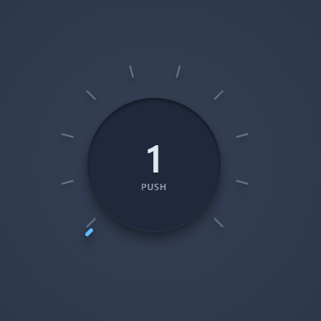
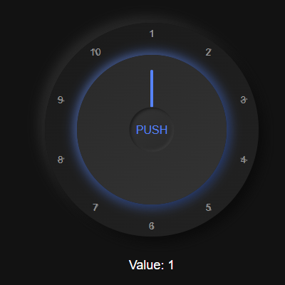
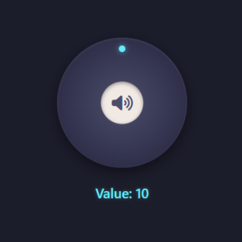
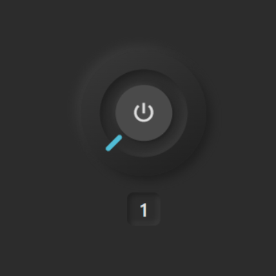
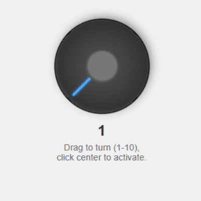
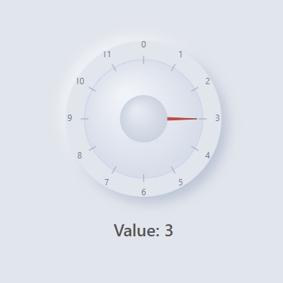

# Interactive Knob Buttons Collection | Free UI Components


A comprehensive collection of **free, open-source, customizable knob controls with integrated push buttons** - perfect for web-based audio applications, control panels, IoT interfaces, and more. These components are designed to provide intuitive, tactile user experiences for your web projects.

## 🎛️ Why This Collection Exists

As a developer passionate about creating intuitive user interfaces, I found myself repeatedly implementing rotary knob controls with integrated buttons for various projects. Each implementation taught me something new about creating engaging, tactile experiences on the web.

I created this collection to:

- Explore different UI/UX approaches to the same interaction pattern
- Experiment with various visual styles and feedback mechanisms
- Provide the community with ready-to-use, customizable components
- Share knowledge about creating complex interactive controls

Rather than keeping these implementations to myself, I'm sharing them with the community under an open license so others can benefit from my explorations.

## ✨ Features

- **Multiple Implementation Styles**: From minimalist to skeuomorphic designs
- **Fully Customizable**: Easily adjust colors, sizes, and behaviors
- **Responsive**: Works across desktop and mobile devices
- **Accessible**: Keyboard navigation and ARIA attributes included in modern implementations
- **Zero Dependencies**: Core implementations use vanilla JavaScript (some demos use optional libraries like GSAP for enhanced animations)
- **Event-Driven API**: Simple event system for integration with your applications

## 🧩 The Collection

### 1. Modern Neumorphic Knob



A sleek, modern knob with soft shadows and highlights creating a neumorphic effect. Features a central push button with custom label.

**Key Features:**
- Smooth snap-to-position rotation
- Elegant neumorphic styling
- Customizable tick marks
- Center button with dynamic value display

**[View Demo →](1.html)**

### 2. Skeuomorphic Knob with Glow Effects



A realistic knob design with physical-looking elements and satisfying glow effects when interacted with.

**Key Features:**
- Realistic 3D appearance
- Interactive glow effects on interaction
- "PUSH" labeled center button
- Animated transitions between states

**[View Demo →](2.html)**

### 3. Minimalist Icon Knob



A clean, minimalist design featuring a FontAwesome icon in the center button and a glowing indicator.

**Key Features:**
- Sleek, minimal design
- FontAwesome icon integration
- Glowing position indicator
- Smooth rotation with snap-to-position

**[View Demo →](3.html)**

### 4. Accessible Neumorphic Knob



A fully accessible implementation with keyboard support, ARIA attributes, and Material Design icons.

**Key Features:**
- Full keyboard navigation
- ARIA attributes for screen readers
- Material Design icon integration
- Haptic feedback animations

**[View Demo →](4.html)**

### 5. Gradient Knob with Glow Effects



A modern knob with gradient effects and a satisfying glow when interacted with.

**Key Features:**
- Gradient color scheme
- Interactive glow effects
- Form integration with hidden input
- Detailed usage instructions

**[View Demo →](5.html)**

### 6. Canvas-Based Knob



A high-performance implementation using HTML5 Canvas for smooth rendering and animations.

**Key Features:**
- Canvas-based rendering for performance
- Highly customizable appearance
- Object-oriented implementation
- Custom event system

**[View Demo →](6.html)**

## 🚀 Usage

Each knob implementation is contained in its own HTML file with inline CSS and JavaScript. To use in your project:

1. Copy the HTML, CSS, and JavaScript from the implementation you prefer
2. Integrate into your project structure
3. Customize colors, sizes, and behavior using CSS variables and configuration options
4. Connect to your application logic using the provided event listeners

### Basic Implementation Example

```html
<!-- HTML Structure -->
<div class="knob-container" id="myKnob">
    <div class="knob">
        <div class="indicator"></div>
        <div class="center-button"></div>
    </div>
</div>

<!-- JavaScript -->
<script>
    const knob = document.getElementById('myKnob');

    // Listen for value changes
    knob.addEventListener('knobchange', (event) => {
        console.log('Knob value changed:', event.detail.value);
        // Update your application state
    });

    // Listen for button clicks
    knob.addEventListener('buttonclick', () => {
        console.log('Center button clicked!');
        // Trigger your application action
    });
</script>
```

## 🛠️ Customization

Each implementation uses CSS variables for easy customization:

```css
:root {
    --knob-size: 200px;
    --knob-bg-color: #333;
    --indicator-color: #00aaff;
    /* Additional variables specific to each implementation */
}
```

Modify these variables to match your application's design system.

## 📱 Responsive Behavior

All knobs are designed to work across devices. For mobile optimization:

```css
@media (max-width: 768px) {
    :root {
        --knob-size: 150px; /* Smaller on mobile */
    }
}
```

## 🔄 Browser Compatibility

Tested and working in:
- Chrome 80+
- Firefox 75+
- Safari 13+
- Edge 80+

## 🤝 Contributing

Contributions are welcome! If you have a new knob design or improvements to existing ones:

1. Fork the repository
2. Create your feature branch (`git checkout -b feature/amazing-knob`)
3. Commit your changes (`git commit -m 'Add amazing knob implementation'`)
4. Push to the branch (`git push origin feature/amazing-knob`)
5. Open a Pull Request

## 💖 Support This Project

If you find this collection useful and want to support continued development of more interactive UI components, consider purchasing a license!

### Support via PayPal

<div align="center">
  <a href="https://www.paypal.com/ncp/payment/UY552N9XUBCA2" target="_blank">
    
  </a>
  <p><i>Your purchase includes a commercial license and supports the development of more UI components!</i></p>
  
</div>

### Other Ways to Support

- ⭐ Star this repository on GitHub
- 🔄 Share with other developers
- 🐛 Report bugs or suggest improvements
- 🤝 Contribute code or documentation

## 📄 License

This project is available under a dual license:

- **Personal/Educational Use**: Free under the MIT License - see the [LICENSE](LICENSE) file for details.
- **Commercial Use**: For commercial applications, please purchase a commercial license through the "Buy Now" button above.

The commercial license includes:
- Use in commercial products and applications
- Priority support
- No attribution requirement

## 🙏 Acknowledgments

- Inspired by hardware synthesizers and audio equipment
- Thanks to the web development community for feedback and suggestions
- Special thanks to all contributors and supporters

---

<p align="center">Made with ❤️ for the web development community</p>
